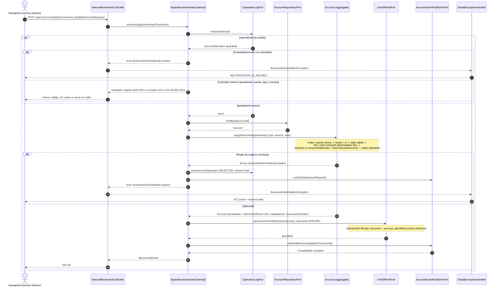

# Secuencia — Aplicar un movimiento (`POST /accounts/{id}/movements`)

Interno (`x-gateway-internal: true`, ver el contrato): en P1/P2 lo llama `transaction-service` por
REST; en P3 el mismo caso de uso se dispara desde un comando de Kafka (`account.command`), sin
cambiar `ApplyMovementUseCaseImpl`. Implementado en `ApplyMovementUseCaseImpl` (R3) +
`InternalMovementController` / `GlobalExceptionHandler` (R5).

## Notas

- La comisión se cobra **también en depósitos**: `movementNumber` cuenta todos los movimientos del
  mes (depósitos y retiros); al superar `freeTransactionsLimit` se descuenta `transactionFee` del
  saldo sin importar el tipo del movimiento que la disparó.
- Un rechazo por regla de negocio **sí** se guarda en `account_operations` (estado `REJECTED`, con
  `reasonCode`): es lo que permite que repetir el mismo `operationId` devuelva el mismo 422 en vez
  de reevaluar las reglas contra un estado de cuenta que pudo haber cambiado.
- `saveAccountAndOperation` es la única escritura atómica del flujo: si el guardado del movimiento
  fallara después de mover el saldo en memoria, ninguna de las dos colecciones queda con datos a
  medias — ver `UnitOfWorkPort` (R4, transacción de Mongo, requiere *replica set*).
