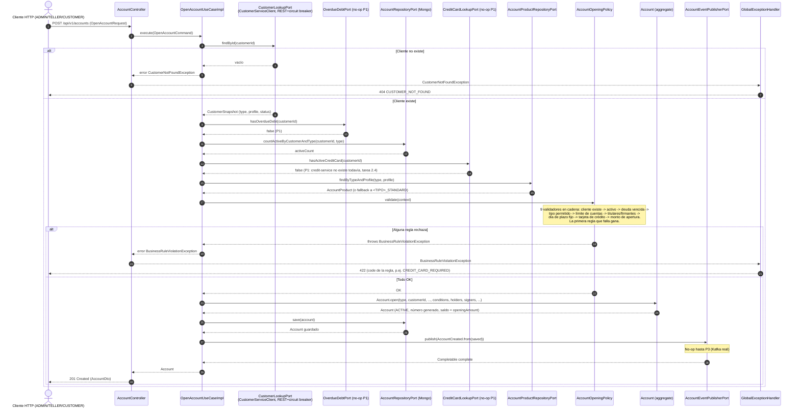

# Secuencia — Abrir cuenta (`POST /accounts`)

Implementado en `OpenAccountUseCaseImpl` (R3) + `AccountController` / `GlobalExceptionHandler`
(R5) + `AccountOpeningPolicy` (R2, cadena de 9 reglas, data-model.md 3.4) + `AccountProductSeeder`
(R6, garantiza que todo `<TIPO>_STANDARD` exista) + `CustomerServiceClient` (R7, REST + circuit
breaker a `customer-service`). Es P1/P2: en P3, `CustomerLookupPort` y `CreditCardLookupPort` se
reimplementan contra read models locales (`customer_snapshots`, `credit_card_snapshots`,
alimentados por Kafka) en vez de llamar por REST — el puerto no cambia, solo el adaptador.

## Notas

- `resolveConditions` (dentro de `OpenAccountUseCaseImpl`) busca primero por `(type, profile)` del
  cliente y si no hay entrada cae al `<TIPO>_STANDARD` del mismo tipo — el contrato lo pide así
  ("si no existe la combinación, se usa STANDARD del mismo tipo") y `AccountProductSeeder` es lo que
  garantiza que ese fallback siempre exista, incluso en una base recién creada.
- `CustomerLookupPort`, `OverdueDebtPort` y `CreditCardLookupPort` se consultan **antes** que
  `AccountOpeningPolicy`: la política es puro dominio (no llama puertos, ver su propio Javadoc), así
  que el caso de uso arma todo el contexto (`OpeningValidationContext`) primero y se lo pasa ya
  resuelto.
- Un timeout o el circuit breaker abierto en `CustomerServiceClient` no cae en esta rama de "cliente
  no existe": se traduce en `DownstreamServiceUnavailableException` → 503 `SERVICE_UNAVAILABLE`
  (ver `GlobalExceptionHandler`), un camino de error distinto al dibujado arriba.
