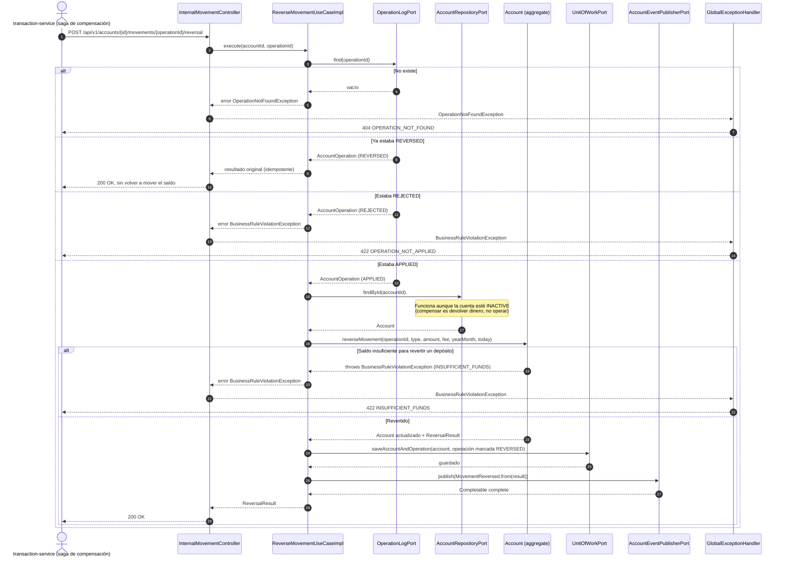

# Secuencia — Revertir un movimiento (`POST /accounts/{id}/movements/{operationId}/reversal`)

Interno (`x-gateway-internal: true`): lo dispara la saga de compensación de `transaction-service`
cuando la segunda pata de una transferencia falla (ver `bank-docs/flows/01-transfer.md`).
Implementado en `ReverseMovementUseCaseImpl` (R3) + `InternalMovementController` /
`GlobalExceptionHandler` (R5).

## Notas

- Sin cuerpo en la petición: todo sale de la `AccountOperation` guardada (monto, comisión,
  `yearMonth`), así que revertir depende solo de historial propio, nunca de lo que envíe el
  llamador.
- A diferencia de `applyMovement`, una reversa que falla (`INSUFFICIENT_FUNDS`) **no** se guarda
  como un nuevo registro: no hay nada que hacer idempotente sobre una reversa que nunca ocurrió — la
  ficha (`account-service.md` 12, pendientes) solo documenta esta forma para movimientos nuevos
  rechazados, no para reversas.
- Si la cuenta fue cerrada y la reversa falla, la saga de `transaction-service` termina en
  `COMPENSATION_FAILED` (`flows/01-transfer.md`) — `account-service` no reintenta por su cuenta.
