# UML de dominio — `account-service`

Dos aggregates (Java records, inmutables): `Account` (cuentas) y `AccountProduct` (catálogo de
condiciones). Todo en `domain/model`, sin dependencias de Spring — mismo criterio que
`customer-service`.

```mermaid
classDiagram
    class Account {
        <<aggregate root, record>>
        +AccountId id
        +AccountNumber accountNumber
        +String customerId
        +CustomerType customerType
        +CustomerProfile customerProfile
        +AccountType type
        +String alias
        +Money balance
        +AccountConditions conditions
        +Integer movementDayOfMonth
        +List~AccountParty~ holders
        +List~AccountParty~ signers
        +MonthlyActivity monthlyActivity
        +BalanceTracker balanceTracker
        +AccountStatus status
        +long version
        +open(type, customerId, ..., conditions, clock)$ Account
        +applyMovement(operationId, type, amount, date, clock) Outcome
        +reverseMovement(operationId, type, amount, fee, yearMonth, today, clock) Outcome
        +close(clock) Account
    }

    class AccountProduct {
        <<aggregate root, record>>
        +ProductId id
        +AccountType accountType
        +CustomerProfile profile
        +AccountConditions conditions
        +Instant updatedAt
        catálogo, editable por ADMIN
        +create(accountType, profile, conditions, clock)$ AccountProduct
        +withConditions(newConditions, clock) AccountProduct
    }

    class ProductId {
        <<value object, record>>
        +String value
        id natural "TIPO_PERFIL", p.ej. SAVINGS_VIP
        +of(type, profile)$ ProductId
        +standardOf(type)$ ProductId
    }

    class AccountConditions {
        <<value object, record>>
        +Money maintenanceFee
        +Money minimumOpeningAmount
        +Integer monthlyMovementLimit
        +int freeTransactionsLimit
        +Money transactionFee
        +Money minimumDailyAverage
        +boolean requiresCreditCard
        copia tomada al abrir; en el catálogo es la maestra
    }

    class Money {
        <<value object, record>>
        +BigDecimal amount
        +String currency
        escala 2, HALF_EVEN, nunca negativo, solo PEN
        +plus(Money) Money
        +minus(Money) Money
        +isGreaterThanOrEqualTo(Money) bool
    }

    class MonthlyActivity {
        <<value object, record>>
        +String yearMonth
        +int movementCount
        se reinicia al cambiar de mes
    }

    class BalanceTracker {
        <<value object, record>>
        +YearMonth yearMonth
        +BigDecimal accumulatedBalanceDays
        +Money lastBalance
        +LocalDate lastChangeDate
        acumulador del promedio diario VIP (informativo, no bloquea)
        +recordChange(newBalance, changeDate) BalanceTracker
        +dailyAverage(asOfDate, accountOpenedDate) BigDecimal
    }

    class AccountParty {
        <<value object, record>>
        +DocumentType documentType
        +String documentNumber
        +String fullName
        titular o firmante: dato propio de la cuenta,<br/>no requiere ser cliente del banco
    }

    class AccountId {
        <<value object, record>>
        +String value
        +newId()$ AccountId
    }

    class AccountNumber {
        <<value object, record>>
        +String value
        14 dígitos, único
    }

    class AccountType {
        <<enumeration>>
        SAVINGS
        CHECKING
        FIXED_TERM
    }

    class AccountStatus {
        <<enumeration>>
        ACTIVE
        INACTIVE
    }

    class MovementType {
        <<enumeration>>
        DEPOSIT
        WITHDRAWAL
    }

    class CustomerType {
        <<enumeration>>
        PERSONAL
        BUSINESS
    }

    class CustomerProfile {
        <<enumeration>>
        STANDARD
        VIP
        PYME
    }

    class DocumentType {
        <<enumeration>>
        DNI
        CEX
        PASSPORT
        RUC
    }

    Account "1" *-- "1" AccountId
    Account "1" *-- "1" AccountNumber
    Account "1" *-- "1" Money : balance
    Account "1" *-- "1" AccountConditions : copia al abrir
    Account "1" *-- "1" MonthlyActivity
    Account "1" *-- "1" BalanceTracker
    Account "1" o-- "0..*" AccountParty : holders
    Account "1" o-- "0..*" AccountParty : signers
    Account --> AccountType
    Account --> AccountStatus
    Account --> CustomerType
    Account --> CustomerProfile
    AccountParty --> DocumentType
    AccountProduct "1" *-- "1" ProductId
    AccountProduct "1" *-- "1" AccountConditions : maestra, editable
    AccountProduct --> AccountType
    AccountProduct --> CustomerProfile
    AccountConditions "1" o-- "0..4" Money
```

## Invariantes que vive el aggregate (no el mapper ni el controller)

| # | Regla | Dónde se aplica |
|---|---|---|
| 5 | `BUSINESS`: al menos 1 titular, 0..n firmantes. `PERSONAL`: sin titulares ni firmantes | `Account.open` (revalidado como invariante, además de `AccountOpeningPolicy`) |
| 6 | Monto de apertura ≥ mínimo de la condición; pasa a ser el saldo inicial | `Account.open` |
| 8 | Plazo fijo: exige `movementDayOfMonth` (1-28); solo 1 movimiento al mes y únicamente ese día | `Account.applyMovement` |
| 9 | Ahorro: tope de movimientos mensuales; al superarlo se rechaza | `Account.applyMovement` |
| 10 | Hasta N transacciones libres al mes; las siguientes cobran comisión, descontada del saldo (también en depósitos) | `Account.applyMovement` |
| 11 | Monto > 0. Un retiro no puede dejar saldo negativo (`amount + fee <= balance`) | `Account.applyMovement` |
| 12 | Cuenta `INACTIVE` no admite movimientos | `Account.applyMovement` |
| 13 | Cierre (baja lógica) solo con saldo 0; es idempotente | `Account.close` |
| 16 | Tipo, cliente y moneda no cambian nunca; el saldo solo cambia por movimientos | `Account` (invariante del record, sin setters) |
| 17 | Reversa: devuelve saldo, comisión y contador de movimientos; es idempotente y se aplica aunque la cuenta esté `INACTIVE` | `Account.reverseMovement` |

Las reglas 1-4 y 7 (cliente existe/activo, deuda vencida, límite de cuentas por tipo, tarjeta de
crédito) **no** viven en `Account`: dependen de datos externos (otro servicio, el repositorio, el
catálogo), así que se resuelven en `AccountOpeningPolicy` — ver el diagrama de secuencia de abrir
cuenta (`docs/sequence/open-account.md`).
